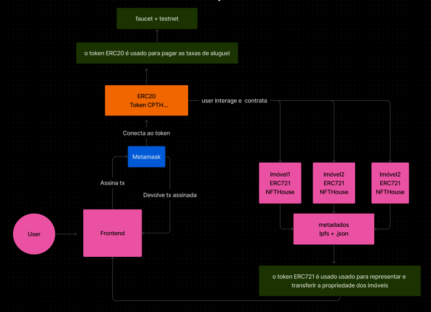
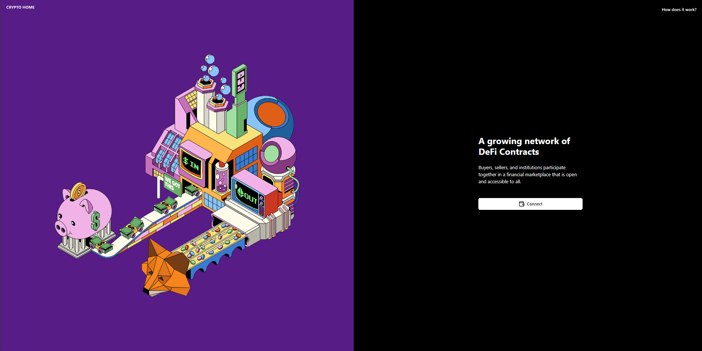

<h1 align="center">CryptoHome</h1>

<h3 align="center">Plataforma descentralizada de locação de imóveis · Web3 · Smart Contracts</h3>

  <code>TypeScript</code> &nbsp;•&nbsp;
  <code>React</code> &nbsp;•&nbsp;
  <code>Solidity</code> &nbsp;•&nbsp;
  <code>MetaMask</code>

---

## 📌 Visão Geral

CryptoHome é uma plataforma de locação de imóveis construída sobre a blockchain Ethereum.
Usuários se autenticam via carteira cripto, interagem com um marketplace de imóveis e
realizam transações financeiras validadas por contratos inteligentes — sem intermediários,
com total rastreabilidade.

---

## ✨ Funcionalidades

- **Autenticação Web3** — login seguro via MetaMask, sem senha ou dado sensível exposto
- **Marketplace de imóveis** — listagem e navegação por propriedades disponíveis para locação
- **Contratos inteligentes** — transações validadas on-chain, sem necessidade de confiar em terceiros
- **Auditoria imutável** — todas as operações registradas permanentemente na blockchain
- **Proteção de dados** — informações criptografadas, privacidade garantida por design

---

## 🛠️ Tecnologias

| Camada | Tecnologia |
|--------|-----------|
| Frontend | TypeScript · React · Tailwind CSS · Shadcn-UI |
| Smart Contracts | Solidity · ERC-20 · ERC-721 |
| Wallet | MetaMask |
| Storage | IPFS |

---

## 🗺️ Roadmap

- [x] Frontend — Login + Marketplace
- [x] Integração com MetaMask
- [x] Página de marketplace e roteamento
- [x] Testes e deploy dos contratos
- [ ] Smart contracts ERC-20 / ERC-721 + integração IPFS *(em andamento)*
- [ ] Integração dos contratos com o frontend *(em breve)*

---

## 🏗️ Arquitetura

---

## 🖥️ Preview da Interface

